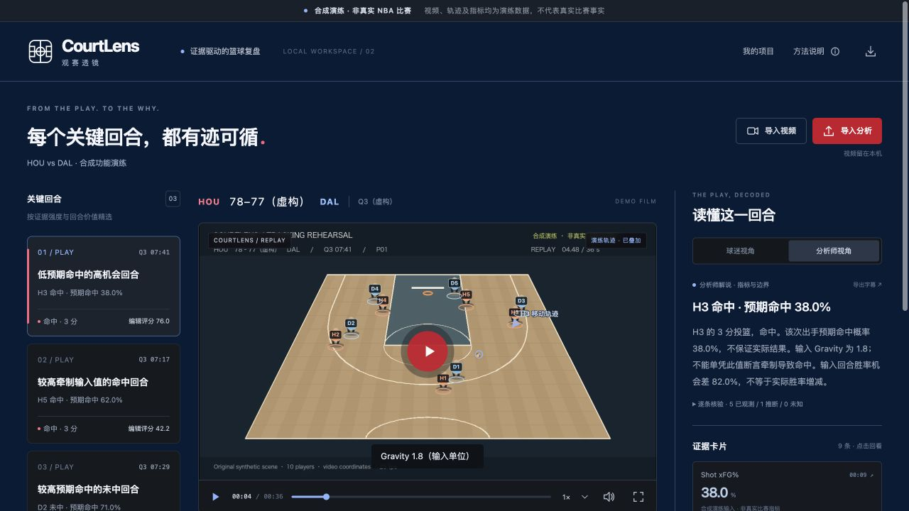

# CourtLens · 观赛透镜

**篮球证据工作台：从一个回合，看懂画面、指标与判断之间的关系。**

[打开在线演练](https://dingyucanada.github.io/courtlens/) · [下载产品与新版 PPT](https://github.com/dingyucanada/courtlens/releases/latest) · [运行说明](#启动与入口)



在线版免安装，提供 36 秒合成演练、3 个回合、双视角解说、同步标注、数据图表、证据问答和分析下载。完整本机版提供视频导入、SQLite 项目历史、人工标注、复核与视频导出。两者使用同一个证据分析引擎。NBA 深蓝、红、白仅作为视觉配色，CourtLens 是独立作品。

当前为 v2.1，本机产品采用单用户模式。可从自己的视频建立项目，导入回合 CSV 或标准 JSON，编辑并复核回合，保存版本历史，添加人工画面标注，在后台导出。项目视频会复制到本机工作区，刷新页面或重启服务后可以继续使用。

正式 NBA 赛题视频和数据尚未发放。本包的内置演练为合成素材；它检验软件流程，不证明真实 NBA 战术识别准确率。云端工具规划器尚未实调，Windows 锁分支仅做模拟测试、未实机验收。全部最终测试及浏览器结果以 [最终验收报告](docs/最终验收报告.md) 为准。

## 启动与入口

在本目录运行：

```sh
python3 tools/launch.py --port 8765
```

打开 [项目工作区](http://127.0.0.1:8765/projects.html)。[复盘台](http://127.0.0.1:8765/) 保留原演练入口；请从项目页点击“打开复盘”查看自己的持久项目。随包的 `启动工作台.command` 与 `启动工作台.bat` 会尝试从已知位置选择已安装且具备 Pillow 的渲染解释器，不自动安装依赖；平台验证范围见最终报告。停止服务按 Ctrl+C。

服务只绑定 `127.0.0.1`，无前端构建步骤。先点击项目页右上角“本机功能”查看依赖。后端使用 Python 标准库；视频持久导入需要 FFprobe，成片导出还需要 FFmpeg 及渲染解释器中的 Pillow。Python 环境和外部工具版本以最终报告为准，Pillow 要求见 [requirements-media.txt](requirements-media.txt)。

如果启动解释器没有 Pillow，但另一个已安装解释器具备渲染依赖，可以指定：

```sh
python3 server.py --port 8765 --render-python /absolute/path/to/python
```

该路径应替换为本机真实解释器路径。也可通过 `COURTLENS_RENDER_PYTHON` 配置。缺少依赖时不会静默声称导出成功；先补齐依赖并重启服务，再重试。

## 推荐使用顺序

1. **创建项目。** 选择“从视频开始”“导入回合表”或“高级数据”，填写真实来源。也可用全合成演练体验。
2. **校正回合。** 填写视频秒数、投篮球员和投篮分值。新建占位回合不是自动识别结果；未知指标留空。
3. **标注与复核。** “画面标注”可添加箭头、矩形区域与文字。人工静态标注有独立来源，不能代表自动追踪已校准。
4. **保存项目。** 每次保存形成 SQLite 历史版本。修改会撤销网页的整体复核状态；核对后勾选“已核对回合时刻与来源”再保存。
5. **导出。** 在“导出记录”创建后台任务；本机支持时可选择中文配音。完成后下载 MP4、WebVTT 与分析 JSON，配音任务另附语音记录。每个任务冻结创建时的版本，继续编辑不改变已排队输入。

默认 MP4 包含画面叠加与字幕、没有音轨。macOS 本机 `say` 可用时，可选离线中文配音；它朗读已编译的同步字幕，不调用云模型。两种模式都不保留原视频音轨。配音不可用、过密或失败时明确报错，不会把无声中间视频冒充配音成片。Windows 当前不提供此配音能力，实际平台结果见最终报告。

## 保存位置与冲突

默认数据位于本目录下 `workspace/`：项目及历史存在 `workspace.sqlite3`，已导入视频位于 `media/`，导出记录和结果位于 `jobs/`。可用 `--workspace /absolute/path/to/workspace` 指定目录。它不会被静态文件服务直接暴露；浏览器通过受控项目接口读取媒体。

项目页遇到 HTTP 409 版本冲突时，旧修改不会覆盖最新版本。先“下载我的草稿”，再“载入最新版本”并比对合并；草稿不是自动合并文件，也不是已保存历史。不要以为未点击保存的浏览器编辑已写进 SQLite。恢复旧版会创建新 revision，保留原历史。

标注页另有“下载标注草稿”，用于保存当前标注数据集 JSON；它不包含视频，也不能代替保存项目或完整工作区备份。

备份应先停止服务，再复制整个工作区。只复制数据库或只有成片都不足以完整恢复项目。当前没有自动云备份、多人协作、账号认证或公网部署功能；只在可信本机环境使用。详见 [产品架构与运维](docs/产品架构与运维.md)。

## 数据与能力边界

- 每个视频最大 512 MiB；服务端核对文件格式、尺寸、时长及 SHA-256。浏览器能否解码仍取决于实际编码。
- CSV 支持最多 200 个回合，时间必须已经映射成视频秒数；错误定位到 CSV 记录结束的物理行。
- xFG 使用 0–1 概率；Gravity 保留来源单位；非空 Leverage 必须显式确认“0–1 回合胜率机会差”，不能冒充球员累计分。
- 人工标注使用 `origin=manual`、`frame_reviewed=true` 与 `author_note`，不改变原 `camera_segments.calibrated`。无轨迹时不会自动追踪球员。
- 系统不从任意转播独立识别人名、恢复场外位置或复现 NBA 专有统计模型。`official` 只是提供者声明，不是软件认证。

## 可选云规划器

网页工作流不调用外部模型。独立的 `tools/cloud_director.py` 可在明确启用且具备 AWS 凭据、模型权限和数据许可后调用 Bedrock；发送选定回合的结构化证据，不发送视频。模型选择已有声明 ID，本地编译可见文字与数值。目前只有模拟提供者的协议测试，**没有完成真实云调用**。配置与运行方法见 [产品架构与运维](docs/产品架构与运维.md)。

## 文档导航

- [产品使用手册](docs/产品使用手册.md)：从新建、标注到导出的操作与故障处理。
- [数据接口与接入](docs/数据接口与接入.md)：CSV、JSON、审核和本机 API。
- [方法与指标](docs/方法与指标.md)：指标解释、人工与追踪的证据边界。
- [参赛策略与产品方案](docs/参赛策略与产品方案.md)：作品主张、强替代、现场计划与路演。
- [专业产品研究](docs/专业产品研究.md)：一手来源、可借鉴机制和数据许可边界。
- [最终验收报告](docs/最终验收报告.md)：唯一的最终计数、实测环境、失败与未验证项汇总。

研究代码与参赛准备已形成可运行产品，但正式比赛规则、允许复用范围、原始素材授权和最终提交仍须按赛方要求核对。

## 复现测试

在项目根目录执行；媒体相关检查需要 FFmpeg/FFprobe、Pillow，macOS 配音检查另需 `say`。请使用装有 Pillow 的 Python 解释器。缺失依赖的跳过不能解释为验收通过。

```sh
python3 -m unittest discover -s tests -p 'test_*.py' -v
node --test tests/*.test.cjs
python3 tests/independent_core.py
python3 tests/independent_media.py
python3 tests/media_export_checks.py
```

日常使用不需要 Node；它只用于前端逻辑测试。随交付包的验收证据记录实际版本、结果和独立反例。

## 网站构建与 GitHub 发布

`site/` 是公开演练站源码，`web/` 是本机完整产品界面。GitHub Pages 提供静态网页，本机 Python 服务和用户工作区不上传至 Pages。

```sh
python3 tools/build_site.py --output ../site-dist --presentation docs/CourtLens-product-deck.pptx
python3 tools/test_site.py
node --test site/logic.test.mjs
```

构建器直接调用 `core.engine` 生成双视角分析与 42 份证据回答，并核对视频 SHA-256。输出目录只允许已知发布文件；发现无关文件或符号链接会停止，防止意外上传。静态站不调用外部模型，也不上传浏览器操作。

推送 `main` 后，GitHub Actions 先运行自动检查，再构建和部署 Pages。首次配置、范围和版本记录见 [GitHub 发布说明](docs/GitHub发布说明.md)。
