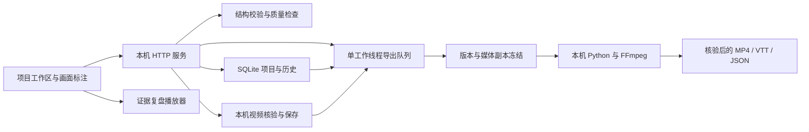

# 产品架构与运维

CourtLens v2 是本机单用户工作台。浏览器负责编辑与回放，本机 Python 服务负责项目、媒体核验和任务，SQLite 保存项目历史与导出状态。它不提供账号、多租户、团队权限、公共分享或云端存储，不能直接按公网 SaaS 部署。

本文描述当前实现；最终实测平台、版本、测试计数与未验证项以 [最终验收报告](最终验收报告.md) 为准。

## 1. 组件如何协作



| 位置 | 当前职责 |
|---|---|
| `server.py` | 只监听 `127.0.0.1`；静态资源、JSON、媒体上传和受控下载；统一请求检查。 |
| `core/workspace.py` | 项目事务、历史恢复、媒体指纹与元信息、能力探测、受控文件路径。 |
| `core/workspace_routes.py` | 将项目、媒体、历史和任务 HTTP 路径转给对应服务。 |
| `core/validation.py` / `core/quality.py` | 严格字段及引用约束、缺失与覆盖报告；不认证事实、版权或篮球因果。 |
| `core/adapters.py` | 创建人工编辑占位数据，或把 CSV 转成标准回合；不执行视觉检测。 |
| `core/engine.py` | 编辑排序、证据与解说编译、受限本地问答。 |
| `core/jobs.py` | 冻结导出输入、排队、进度、取消、重启处理和结果核验。 |
| `web/projects.html` / `web/annotate.html` | 持久项目流程与独立人工标注页面。 |
| `tools/export_video.py` / `tools/narrate_video.py` | 前者渲染无音轨基础成片；选择配音时由后者在 macOS 本机合成同步中文语音。 |

播放器的唯一同步时钟是视频播放位置。项目页修改数据，复盘页读取已保存版本；未保存表单不会自动进入其他页面或已经创建的任务。

## 2. 运行与依赖

在应用目录启动：

```sh
python3 server.py --port 8765
```

访问 [项目工作区](http://127.0.0.1:8765/projects.html)。随包启动脚本通过 `tools/launch.py` 在环境配置、项目 `.venv`、当前解释器及已知运行时位置寻找已安装的 Pillow 环境，不自动安装任何软件。找不到时仍使用当前 Python，导出是否可用以本机功能探测为准。脚本及平台实际验证见最终报告，不要仅凭存在 `.bat` 文件就认定 Windows 已经实机验收。

后端核心使用 Python 标准库，无前端打包步骤。视频持久导入依赖 FFprobe；成片导出还需要 FFmpeg 和渲染 Python 中的 Pillow。可选配音使用 macOS 本机 `say`，默认中文语音为 Tingting；能力探测检查工具是否可用，实际语音资源及成片仍在任务中核验。Windows 当前不提供这一配音功能。Pillow 安装约束见 [requirements-media.txt](../requirements-media.txt)。在所选环境中安装媒体 Python 依赖可使用：

```sh
python3 -m pip install -r requirements-media.txt
```

此命令不安装 FFmpeg 或 FFprobe；这两个可执行文件须在启动服务的环境路径中可见。通过项目页“本机功能”或 `/api/capabilities` 检查实际能力。没有依赖时，项目编辑仍可使用相应已有数据，但视频核验或导出会明确失败。

服务解释器与渲染解释器可以不同：

```sh
python3 server.py --port 8765 --workspace /absolute/path/to/workspace --render-python /absolute/path/to/python
```

两个绝对路径都须替换成本机真实路径。`--render-python` 默认读取 `COURTLENS_RENDER_PYTHON`，未指定时使用服务本身的解释器。不要把密钥写入启动脚本、标准数据集或浏览器表单。

## 3. 工作区与持久性

默认路径为应用目录下 `workspace/`，也可由 `--workspace` 指定。该目录不作为静态站点目录公开。典型结构为：

```text
workspace/
  workspace.sqlite3       项目、历史和任务记录
  workspace.sqlite3-wal   SQLite 运行期间可能存在的文件
  workspace.sqlite3-shm   SQLite 运行期间可能存在的文件
  .exports.lock           当前工作区的进程锁
  media/                  已注册的视频文件，按 SHA-256 命名
  incoming/               上传中的临时文件
  jobs/<任务ID>/           冻结数据、渲染日志及完成结果
```

SQLite 使用 WAL 和完整同步设置，保存操作以事务写入当前项目及历史。保存、成功换源、恢复旧版都会生成新的 revision；恢复不是回滚删除历史。媒体按内容指纹保存，历史版本保留对应媒体引用。相同字节可复用已注册文件，但不会凭文件名认定是同一视频。

视频上传先写临时文件，逐块计算 SHA-256，然后用 FFprobe 检查容器、尺寸、时长和旋转信息。与项目视频尺寸不一致、时长相差超过 0.1 秒、格式不支持或指纹绑定异常时，不把失败上传提交为新版本。单文件上限 512 MiB，标准视频时长上限为 4 小时；受浏览器编码支持和本机性能影响，实际工作宜使用较短的片段。

换源能够更新字节指纹，但不会重新理解视频或重算事件位置。即使宽高与时长相同，仍需人工检查是不是同一内容以及坐标是否适用。

## 4. 编辑、审核和版本冲突

写入请求携带 `expected_revision`。服务只有在其等于当前版本时才提交，否则返回 409，防止两个窗口互相覆盖。项目页可下载冲突草稿并载入最新版；没有自动合并。浏览器内存中的草稿不能代替磁盘备份。

网页创建或导入的数据从 `workflow.state=draft` 开始，编辑会撤销复核；用户核对时刻与来源后，保存为 `reviewed`。质量检查阻断显式草稿、无视频指纹和未完成占位等。复核是操作者声明，不是独立认证。

纯分析接口为兼容旧 schema 1.0，仍允许省略 `workflow`；持久项目在创建、保存或恢复时会把缺失声明补为 `draft`。后台导出再次要求明确的 `workflow.state=reviewed`，旧历史也不能靠省略字段绕过。第三方接入应显式管理工作流，编辑后撤销复核。本机没有身份认证，因此 `reviewed` 不是带责任人签名的审批记录。

## 5. 后台任务与恢复语义

同一工作区只有一个导出执行线程，最多另有四个排队任务。排队前检查版本、质量、渲染依赖和持久媒体。每个任务写入数据快照，并实际复制媒体为独立输入；随后复核 SHA-256。因此，创建任务后的项目编辑不会改变该任务的输入。

状态依次为 `queued`、`running`，最终进入 `complete`、`failed` 或 `cancelled`。不配音任务按真实帧进度推进，结束核验前保持小于 100%。配音任务先渲染视频，再按实际合成字幕条数推进语音阶段，最后核验结果；缺少进度事件时只显示当前阶段。进度不提供剩余时间承诺。

取消排队任务会终止等待；取消运行任务会请求终止渲染或配音进程及其子进程，完成状态以返回结果为准。已完成任务不会因取消请求而回退。任务结束检查输出尺寸、时长、分析绑定与字幕结构；配音任务另检查音轨及语音记录中的字幕、时刻和证据 ID。之后才开放 `replay.mp4`、`replay.vtt`、`replay.analysis.json`，配音成功时另有 `replay.voice.json`。

配音默认关闭，须在创建任务时显式选择。它朗读已编译的字幕，不调用外部模型，也不混入原始音轨。字幕太密、工具失败、缺少语音或用户取消时，整个配音任务失败或取消并清理中间文件，不开放无声中间视频。用户可以修复后重试，也可主动创建不配音的新任务。

关闭浏览器不影响正在运行的本机服务；停止服务会中断任务。重新启动时，遗留排队或运行任务被标为失败，说明服务中断，**不会自动重跑或断点续传**。用户核对项目后重新导出。成功任务保留结果、快照与日志，删除临时媒体副本；失败或取消任务清除工作文件，在数据库中保留有界错误摘要。

工作区锁防止两个服务同时恢复和处理同一队列。POSIX 使用 `fcntl`，Windows 实现使用 `msvcrt`；Windows 分支当前仅模拟测试，尚未实机验证。遇到工作区被占用，应正常停止原服务或选择另一目录，不要删除活动锁文件强行启动。

## 6. 备份、磁盘与排障

可靠备份流程是：停止服务，等待退出，复制**整个工作区**到备份位置，再启动原服务。恢复时也先停止服务，以完整备份作为新的 `--workspace` 启动，并检查项目、媒体和已完成导出。不要只复制数据库，亦不要在服务写入过程中单独复制 WAL 文件。

目前没有自动备份、媒体清理策略、项目删除界面或云端恢复功能。历史版本会保留媒体引用，成功导出也占用空间；创建多个排队任务时还要预留每个输入副本与成片空间。不要直接删 `media/` 中看似旧的视频或手工修改数据库。需要归档时可备份旧工作区，然后用新的空工作区继续工作。

排障首先查看页面明确错误和本机功能，再检查启动终端。访问日志不写入提问正文与整份请求数据，但项目、任务快照和分析文件本来就包含用户数据；操作系统日志及用户主动保存的日志另行管理。不能把“没有云上传”理解成“本地不存数据”。

常见处置：依赖缺失时修复环境并重启；409 时保留草稿并取最新版；队列满时等待或取消；文件损坏时从完整备份恢复或重新导入并复核；磁盘不足先停止新任务并腾出可信空间。不要反复点击导出来掩盖同一故障。

## 7. 本机边界与可选云分支

服务检查本机 Host 和请求来源，限制请求体、文件路径及下载文件，并设置浏览器安全响应头。这些措施不构成账户隔离，也不防御已控制本机的其他进程。当前仅面向可信本机使用，无 TLS、用户权限与多人审计，不要用反向代理、端口映射或隧道直接开放给外部用户。

网页问答与项目导出不调用云模型。独立 Bedrock 工具规划 CLI 需要另装 [requirements-cloud.txt](../requirements-cloud.txt)、配置 `AWS_REGION`、真实的 `COURTLENS_BEDROCK_MODEL` 和有权限的 AWS 凭据，然后显式启用：

```sh
python3 tools/cloud_director.py --data data/demo.json --possession p01 --question '为什么选这一回合' --output cloud-answer.json --enable-cloud
```

只有取得相应数据使用许可后才运行。它发送选定回合的结构化证据，不发送视频；模型选择已有声明 ID，本地校验并编译最终数值。云端失败会明确报告，不伪装成云端成功。该分支当前仅完成模拟协议测试，尚未真实调用，不能据此报告成本、延迟或模型效果。

## 8. 下一阶段运营与商业化：待验证计划

当前可交付形态是可在本机运行、重复保存和导出的单用户产品。下一阶段可先邀请具备合法素材的内容制作者或分析人员试用，记录建立项目、复核、返工、导出的真实耗时和失败原因；没有访谈、使用或付费记录前，不估算已实现收入或市场份额。

如果验证了远程协作需求，再单独设计账户权限、租户隔离、对象存储、任务配额、审核身份、数据保留与删除、监控告警、计费及素材授权流程。这些均属于未来建设范围，当前 SQLite、本机锁和手工复核声明不能替代它们。先用可记录的工作流收益验证价值，再决定席位或处理量收费是否合理。
